# Introduction

## Mesh Cells to Augment in Situ Spectroscopy

Presenter: Jose Andres Cortes
Advisors: Andrej Korzeniowski, Allen Torbert, Galina Yakubova and Aleksandr Kavetskiy
Groups: UTA Mathematics, USDA Agriculture Research Service
Date: July 8, 2025

*Good Morning, My name is Jose Andres Cortes. I'm a second year grad student in mathematics from the University of Texas at Arlington. I am also an intern for the US Department of Agriculture. My advisors are doctors Andrej Korzeniowski, Allen Torbert, Galina Yakubova and Aleksandr Kavetskiy.*

## Background

- Collaborating with USDA Agriculture Research Service
- Developing an in situ spectroscopy device for soil analysis

*For the last two years UTA my advisor and I have collaborated with the USDA Agriculture Research Service, assisting them in the development of an in situ spectroscopy device.*

## Core Harvesting

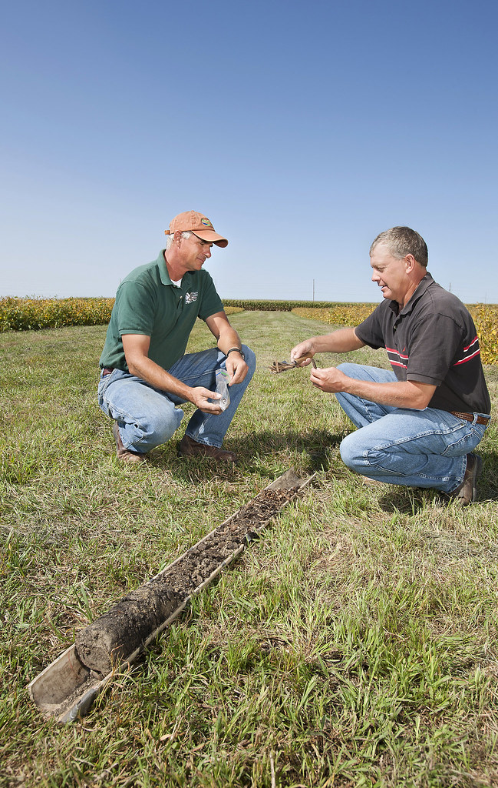

- Traditional method: “Core Harvesting”
- Large soil cores extracted and analyzed in lab
- Time-consuming, labor-intensive

*Currently the method of measuring carbon in a field is "Core Harvesting". Core harvesting is where large tubes called "cores" are dug into the soil and taken to a lab for analysis.*

## In Situ Spectroscopy Device

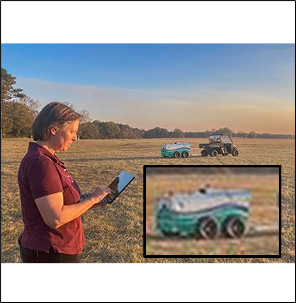

- Fast, nondestructive, cost-effective alternative
- “Mobile Inelastic Neutron Scattering System”
- Uses gamma ray spectroscopy to measure soil composition directly

*In situ spectroscopy is a fast, nondestructive, and cheap alternative to core harvesting. Called the "Mobile Inelastic Neutron Scattering System". This device uses gamma ray spectroscopy in order to directly measure soil composition.*

## Simulation is done in MCNP

- My role: Mathematical support and simulation
- Analyze and generate spectroscopy results
Simulations performed in MCNP6.2
- Presenting challenges addressed with MCNP

*As an intern I have been tasked with mathematical support of the project. Including generation and analysis of the the spectroscopy results. Simulation is done in MCNP6.2 and today I'll be presenting some challenges that I answered with the software.*

# Soil in MCNP

## Soil is a Nonhomogenous Material

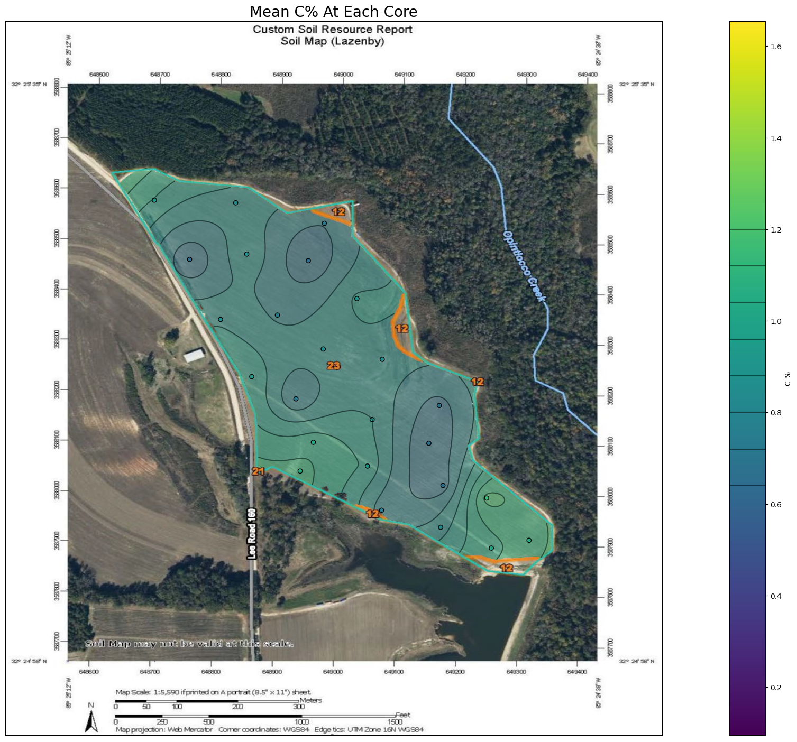

- MCNP cells assume homogeneous material
- Real soil: heterogeneous

*In MCNP, cells are used to define geometry and material properties. But it assumes that a cells material is homogeneous within the cell. In reality, soil is heterogeneous, with varied properties at different parts of the field.*

## Carbon by Depth

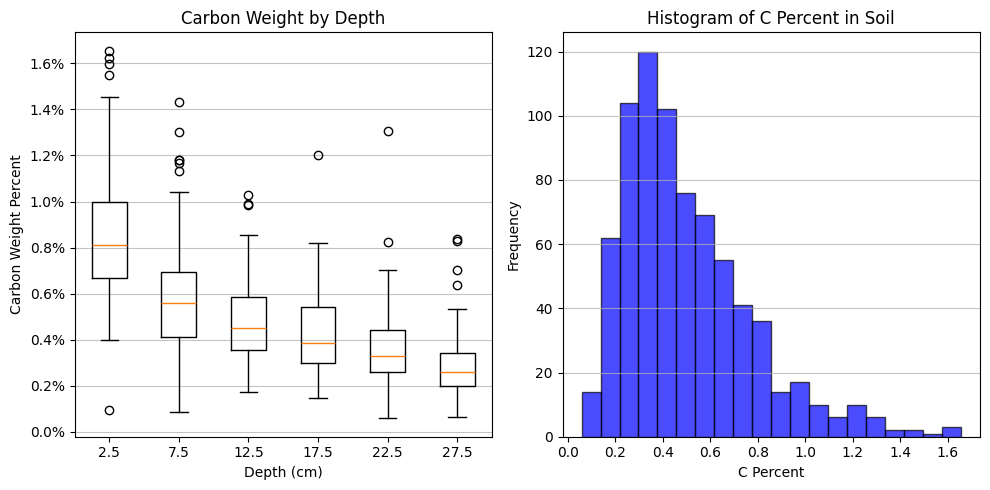

- Carbon often decreases exponentially with depth

*But even within the range of detection, carbon content can be varied. Particularly in depth, where most of the carbon that is deposited can be modeled as decreasing.*

## Functionally Defined Soil

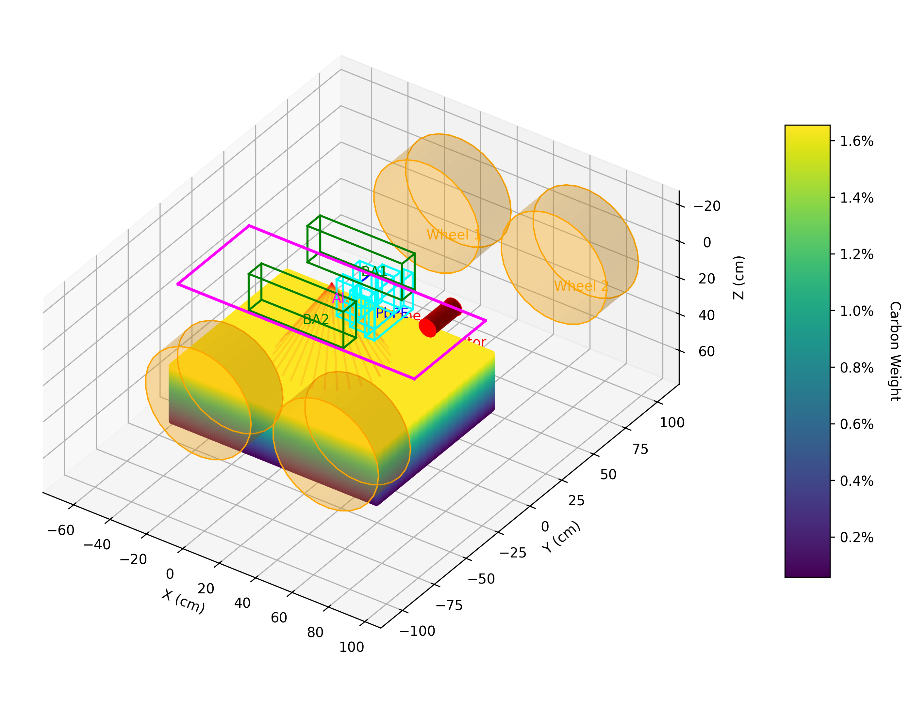

- Soil characteristics can be described as functions of 3D space
- Needed a way to translate this into MCNP input

*Mathematically we can describe the soil characteristics with a function dependent on 3 dimensional space. I needed a method to translate this description into MCNP.*

## Mesh Cells

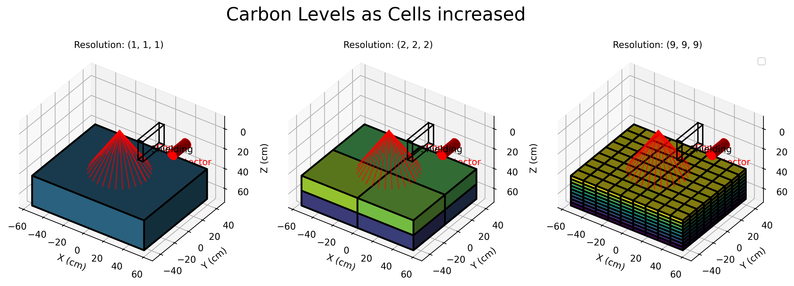

- Divide soil into a mesh of smaller cells
Approximate functional characteristics in discrete space
- Higher mesh resolution = more accurate representation

*Instead of modeling the soil as a single cell, we can cut it into a mesh of smaller cells, from here we can approximate functional characteristics into discrete space. We start with a function describing relevant soil characteristics that are varied spatially. We then describe the geometry of the sample. The geometry is cut into sections of an arbitrary resolution. The higher the resolution, the closer the model would be to the functional description.*

## Defining cell characteristics

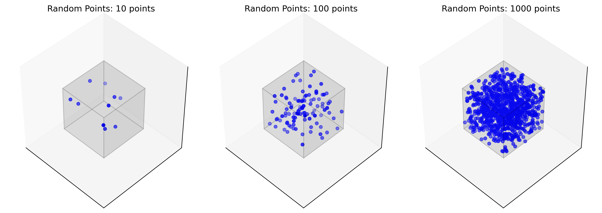

- Use Monte Carlo sampling to average properties in each mesh cell
- Assign average values to each cell
Results in a more detailed, accurate soil mode

*So how do we pick a soils characteristic? To generalize this to any type of function, in each section, we use a monte carlo method to randomly and uniformly pick many points inside the volume to find the average characteristic. The average characteristics are then set as the defenition of the section.*

# Results

## effects on detection

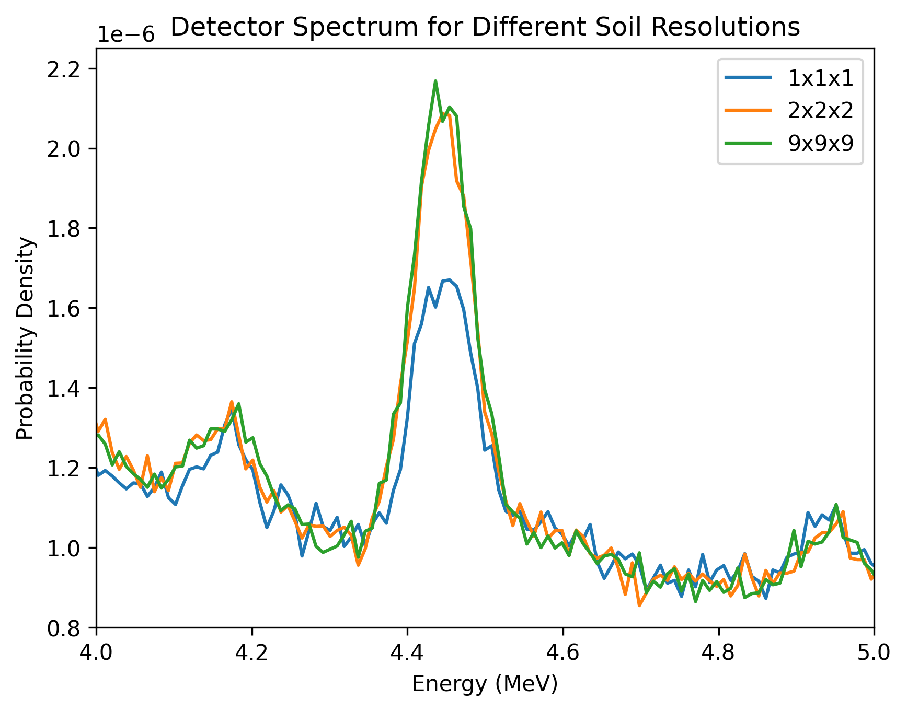

- As mesh resolution increases, carbon density approaches true function
- Effects on spectral readings around key energy ranges (e.g., 4.4 MeV)

*We can see the effects of this technique on spectral readings. Particularly around 4.44 MeV range where we see the carbon indication peak.*

## Lab spectroscopy can cover entire sample

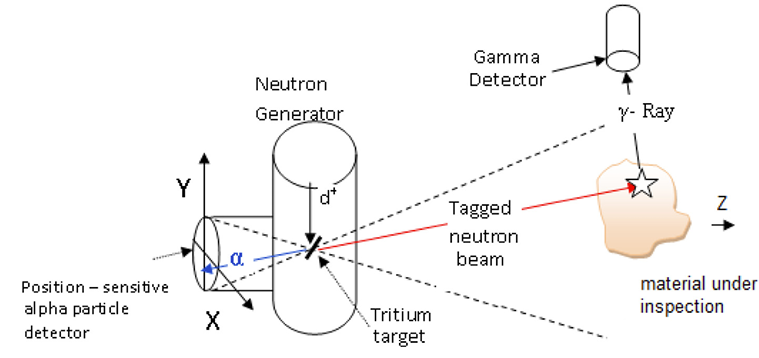

- Investigate detection range of the device
- Lab: detector covers entire sample

*One of the focuses of my work has been on the range of the machine. In lab spectroscopy, the detector can be situated such that the entire sample is within range.*

## Soil is a Semi-Infinite Sample

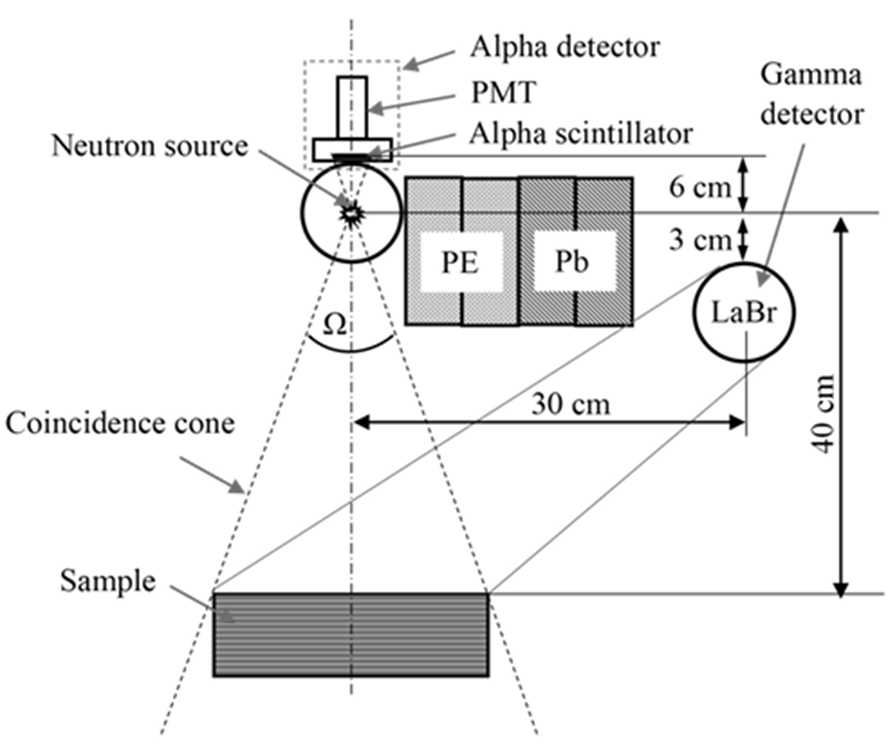

- Investigate detection range of the device
- Field: soil is semi-infinite, detection range is finite

*On the field, soil is semi-infinite while the probing is still finite.*

## Cell Mesh vs FMESH

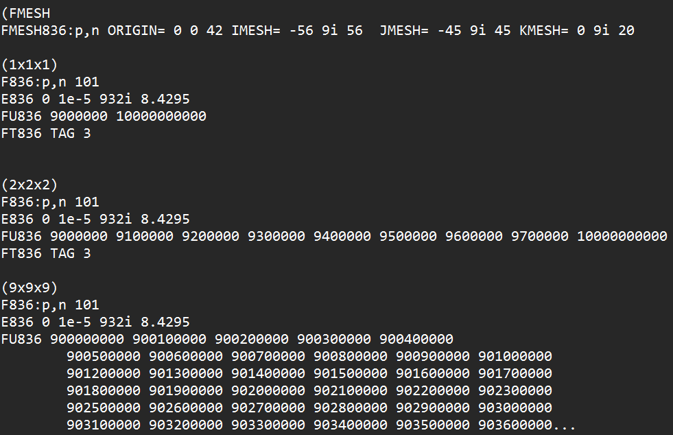

- MCNP FMESH: tally results in mesh bins (for imaging, range studies)
- Cell meshes: can also tally per cell
- Both methods help analyze detection range

*So how can you measure range in MCNP? The FMESH feature allows you to tally with bins on a mesh in space. This feature is meant for imaging on the detector side, and can also be used to investigate the range from the neutron source into the sample. Similarly, cell meshes can have tallies applied to them, accomplishing the same thing as FMESH. The main limit being the number of cells you can use on certain cards such as the CU card.*

## Independent Cell Functionality

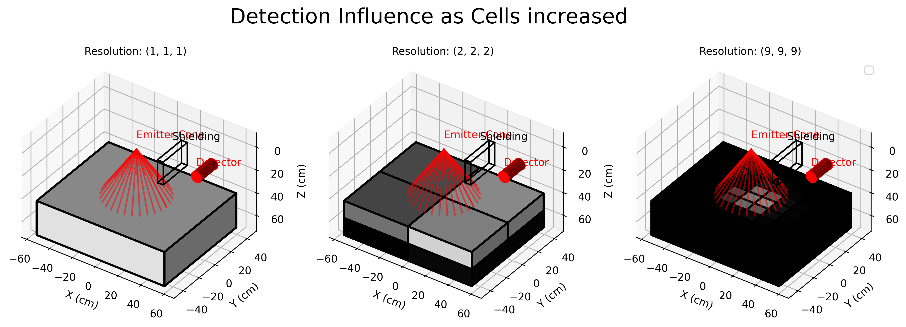

- Treat mesh cells as independent
- CU card: bins tally by cell of interaction
- Allows investigation of where detections originate

*The novel functionality is the treatment of the mesh as independent cells. The CU card on the detector creates bins based on the cell where the interacting particle was generated. By setting the parameters of the CU card to the cells in the mesh, we can investigate where the detectors are detecting.*

## Cell clouds

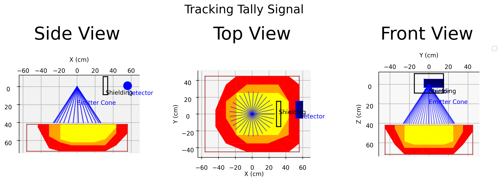

- Cells can be grouped into "clouds" by influence
- 90%, 95%, 99% detection influence

*We can order the cells by their influence on the detector, and get a better grasp of where the top 90, 95 and 99% of unimpeded signal is originating.*

## Range measurement

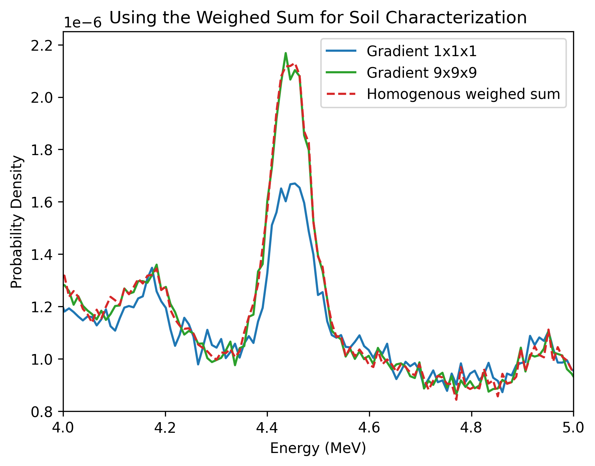

- Sum(Cell detector influence * Cell Carbon weight) = Measured Carbon
- Compare with homogeneous cell readings

*In the 9 by 9 by 9 mesh, I multiply each cells influence by its carbon content, and then sum these values. This gives me a weighted sum of the carbon content. If I set this value as the characteristic of a single homogenous cell, it aligns well with the heterogenous meshed model.*

## Usage Example

- When machine design changes, simulate new detection results
- Range can be re-evaluated
- Example: pointing emitter under detector changes detection range

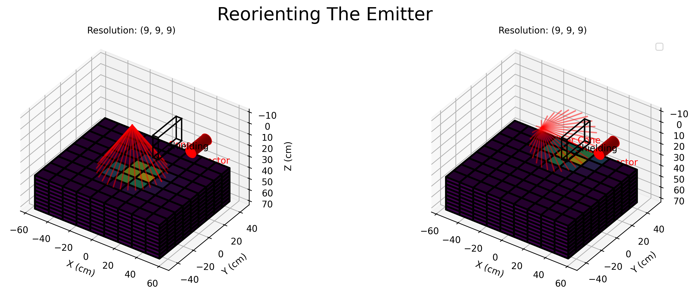

*Moving forward, when the architecture of the machine is changed and the detection results are simulated, range can also be determined. In this example, as we point the emitter under the detector, we see the effects on the range.*

# Conclusion

## Summary

- Mesh cells allow for detailed soil modeling in MCNP
- Enables accurate simulation of in situ spectroscopy
- Helps understand detection range and sensitivity

*In conclusion, mesh cells allow for detailed soil modeling in MCNP, enabling accurate simulation of in situ spectroscopy. This helps us understand the detection range and sensitivity of the device.*

## Future Work

- Further refine mesh resolution for improved accuracy
- Explore additional soil characteristics (hydration)
- Accurate comparison with core harvesting results

*Future work includes further refining the mesh resolution for improved accuracy, exploring additional soil characteristics such as hydration, and making accurate comparisons with core harvesting results.*

## Contact

- Jose Andres Cortes
- Email: jose.cortes@uta.edu
- linkedin.com/in/cortesjoseandres

*If you would like access to the scripts, please feel free to contact me*

## Acknowledgements

- Thanks to my advisors for guiding me through this process. 
- Thank you to UTA and USDA-ARS for funding my research

*Thanks to my advisors for guiding me through this process. Thank you to UTA and USDA-ARS for funding my research*

## References

[^1] - Yakubova et al. - 2014 - Field Testing a Mobile Inelastic Neutron Scattering System to Measure Soil Carbon.

