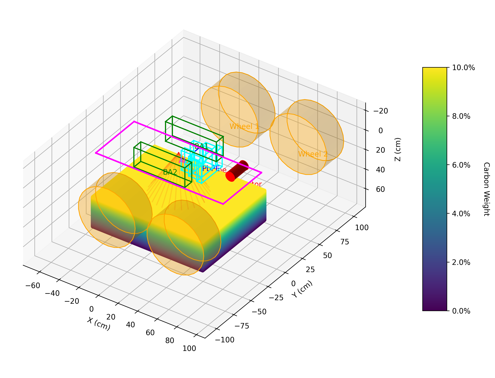
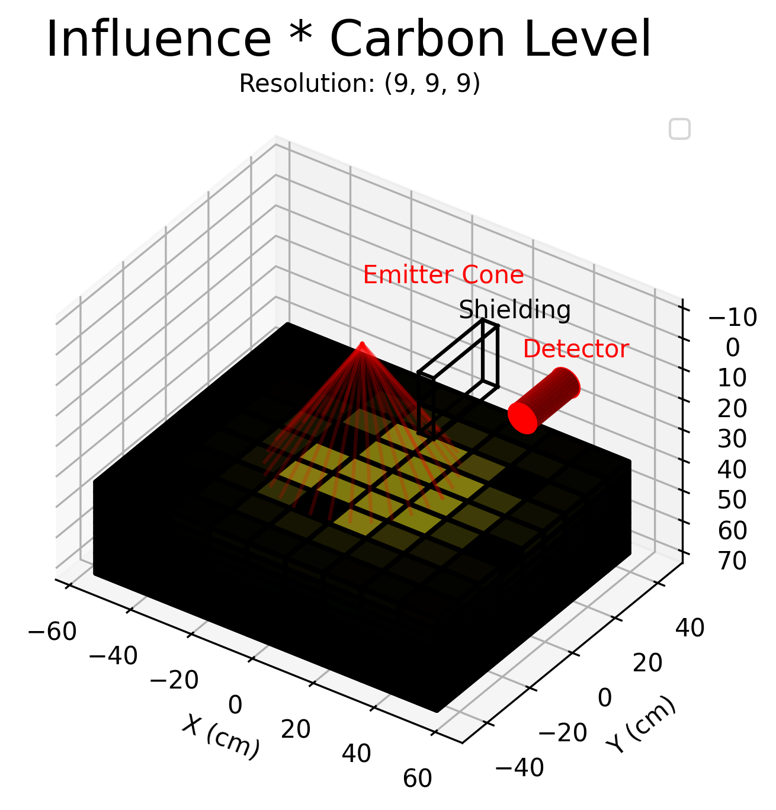
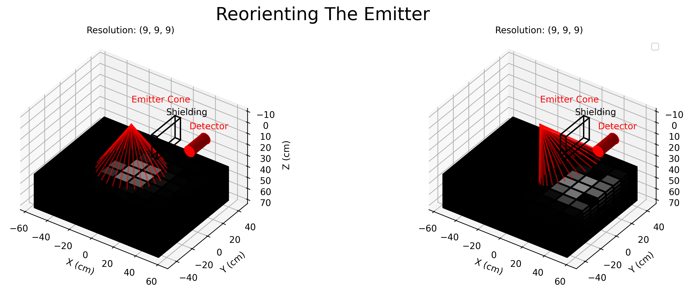

# Introduction

## Mesh Cells to Augment in Situ Spectroscopy

Presenter: Jose Andres Cortes
Advisors: Andrej Korzeniowski, Allen Torbert, Galina Yakubova and Aleksandr Kavetskiy
Groups: UTA Mathematics, USDA Agriculture Research Service
Date: July 8, 2025

*Hello Everyone, My name is Jose Andres Cortes. I'm a second year grad student in mathematics from the University of Texas at Arlington. I am also an intern for the US Department of Agriculture. My advisors are doctors Andrej Korzeniowski, Allen Torbert, Galina Yakubova and Aleksandr Kavetskiy.*

## Background

- Collaborating with USDA Agriculture Research Service
- Developing an in situ spectroscopy device for soil analysis

*For the last two years my UTA advisor and I have collaborated with the USDA Agriculture Research Service, assisting them in the development of an in situ spectroscopy device.*

## Core Harvesting

- Traditional method: “Core Harvesting”
- Large soil cores extracted and analyzed in lab
- Time-consuming, labor-intensive

*Currently the common method of measuring carbon in a field is "Core Harvesting". Core harvesting is where large tubes called "cores" are dug into the soil and taken to a lab for analysis.*

## In Situ Spectroscopy Device

- Fast, nondestructive, cost-effective alternative
- “Mobile Inelastic Neutron Scattering System”
- Uses gamma ray spectroscopy to measure soil composition directly

*In situ spectroscopy is a fast, nondestructive, and cheap alternative to core harvesting. Called the "Mobile Inelastic Neutron Scattering System". This device uses gamma ray spectroscopy in order to directly measure soil composition.*

## Simulation is done in MCNP

- My role: Mathematical support and simulation
- Analyze and generate spectroscopy results
Simulations performed in MCNP6.2
- Presenting challenges addressed with MCNP

*As an intern I have been tasked with mathematical support of the project. Including simulation and analysis of the the spectroscopy results. Simulation is done in MCNP6.2 and today I'll be presenting some challenges that I answered with the software.*

# Soil in MCNP

## Soil is a Nonhomogeneous Material

- MCNP cells assume homogeneous material
- Real soil: heterogeneous

*In MCNP, cells are used to define geometry and material properties. But it assumes that a cells material is homogeneous within the cell. In reality, soil is heterogeneous, with varied properties. Including varied Carbon Content, at different parts of the field.*

## Carbon by Depth

- Carbon often decreases exponentially with depth

*But even within the range of detection, carbon content can be varied. Particularly in depth, where most of the carbon that is deposited can be modeled as decreasing.*

## Functionally Defined Soil

- Soil characteristics can be described as functions of 3D space
- Needed a way to translate this into MCNP input

*Mathematically we can describe the soil characteristics with a function dependent on 3 dimensional space, In this case decreasing. I needed a method to translate this description into MCNP.*

## Mesh Cells

- Divide soil into a mesh of smaller cells
Approximate functional characteristics in discrete space
- Higher mesh resolution = more accurate representation

*This was my solution, Instead of modeling the soil as a single cell, we can cut it into a mesh of smaller cells, from here we can approximate functional characteristics into discrete space. We start with a function describing relevant soil characteristics that are varied spatially. We then describe the geometry of the sample. The geometry is cut into sections of an arbitrary resolution. The higher the resolution, the closer the model would be to the functional description.*

## Defining cell characteristics

- Use Monte Carlo sampling to average properties in each mesh cell
- Assign average values to each cell

*So how do we pick a cells characteristic? To generalize this to any type of function, in each section, we use a monte carlo method to randomly and uniformly pick many points inside the volume to find the average characteristic. The average characteristics are then set as the defenition of the section.*

# Results

## effects on detection

- As mesh resolution increases, carbon density approaches true function
- Effects on spectral readings around key energy ranges (e.g., 4.4 MeV)

*We can see the effects of this technique on the F8 tally of the detector, which is closest to spectral readings. Particularly around 4.44 MeV range where we see the carbon indication peak significantly rise, despite the average of the entire sample being the same. Why does that happen?*

## Lab spectroscopy can cover entire sample

- Investigate detection range of the device
- Lab: detector covers entire sample

*One of the focuses of my work has been on the range of the machine. In lab spectroscopy, the detector can be situated such that the entire sample is within range.*

## Soil is a Semi-Infinite Sample

- Investigate detection range of the device
- Field: soil is semi-infinite, detection range is finite

*On the field, soil is semi-infinite while the probing is still finite.*

## Cell Mesh vs FMESH

- MCNP FMESH: tally results in mesh bins (for imaging, range studies)
- Cell meshes: can also tally per cell
- Both methods help analyze detection range

*So how can you measure range in MCNP? The FMESH feature allows you to tally with bins on a mesh in space. This feature is meant for imaging on the detector side, and to measure activity in the simulation. Similarly, cell meshes can have tallies applied to them, accomplishing FMESH like tallies at least within the cell.*

## Independent Cell Functionality

- Treat mesh cells as independent
- U card: bins tally by cell of interaction
- Allows investigation of where detections originate

*The novel functionality is the treatment of the mesh as independent cells. The U card on the detectors f6 tally creates bins based on the cell where the detected particle was generated. By setting the parameters of the U card to the cells in the mesh, we can investigate how each cell influences the detector. Currently the main limit to resolution of this method are the number of cells you can use on the U card. In this case I go up to 9 by 9 by 9.*

## Cell influence clouds

- Cells can be grouped into "clouds" by influence
- 90%, 95%, 99% detection influence

*Focusing on the 9 by 9 by 9. We can group the cells by their influence on the detector, and get a better grasp of where the top 90, 95 and 99% of the unimpeded signal is originating. But How useful is that information?*

## Measured Characteristic

- Sum(Cell detector influence * Cell Carbon weight) = Measured Carbon

*In the mesh, I multiply each cells influence by its carbon content, and then sum these values. This gives me a weighted sum of the measured carbon content.*

## Gradient vs Homogeneous Characteristic from Gradient Weighed Avg

- Weighted sum of homogeneous cell returns similar results to heterogeneous mesh

*If I set this value as the characteristic of a single homogeneous cell, it aligns well with the heterogeneous meshed model.*

## Usage Example

- When machine design changes, simulate new detection results
- Range can be re-evaluated
- Example: pointing emitter under detector changes detection range

*Moving forward, when the architecture of the machine is changed and the detection results are simulated, range can also be determined. In this example, as we point the emitter under the detector, we see its effects on the mesh. After a single run, the measured influence can give us quick insight on how the changes in design impact the detection capabilities.*

# Conclusion

## Summary

- Mesh cells allow for detailed soil modeling in MCNP
- Enables accurate simulation of in situ spectroscopy
- Helps understand detection range and sensitivity

*In conclusion, mesh cells increase detail on soil modeling in MCNP, enabling accurate simulation of in situ spectroscopy. This helps us understand the detection range and sensitivity of the device.*

## Future Work

- Further refine mesh resolution for improved accuracy (theoretical limit of 10,000 cells)
- Explore additional soil characteristics (hydration)
- Accurate comparison with core harvesting results

*Future work includes refining the mesh resolution for improved accuracy, exploring additional soil characteristics such as hydration, and making accurate comparisons with core harvesting results.*

## Contact

- Jose Andres Cortes
- Email: jose.cortes@uta.edu
- linkedin.com/in/cortesjoseandres

*If you would like access to the scripts, please feel free to contact me.*

## Acknowledgements

- Thanks to my advisors for guiding me through this process.
- Thank you to UTA and USDA-ARS for funding my research

*Thanks to my advisors for guiding me through this process. Thank you to UTA and USDA-ARS for funding my research. And a special thanks to yall for listening. Any Questions? Q1. For safety a study was published in 2024, The detector is run in short bursts. In a worst case senario, it was left running in a single spot for an hour. Within the next hour, radioactivity decreased to natural background levels. Q2. At 1e9 histories, a single cell took about 3500 secconds, while the 9 by 9 by 9 mesh took double that time just under 7000 seconds.*

## References 1

- Yakubova et al. - 2014 - Field Testing a Mobile Inelastic Neutron Scattering System to Measure Soil Carbon.
- d2399-1 by USDAgov is licensed under CC BY 2.0.
- J. Copley, Introduction to Neutron Scattering, presented at the Summer School on the Fundamentals of Neutron Scattering, NIST Center for Neutron Research, Jul. 17, 2013. Available: https://www.ncnr.nist.gov/summerschool/ss13/pdf/SS2013_Lecture_Copley.pdf

*Here are the references.*

## References 2

- C. J. Werner et al., MCNP User's Manual Code Version 6.2. Los Alamos National Laboratory Tech. Rep. LA-UR-17-29981, Los Alamos, NM, USA, Oct. 2017.
- C. R. Bates, S. R. Bolding, C. J. Josey, J. A. Kulesza, C. J. Solomon Jr., and A. J. Zukaitis, ``The MCNPTools Package: Installation and Use,'' Los Alamos National Laboratory Tech. Rep. LA-UR-22-28935, Los Alamos, NM, USA, Aug. 2022, doi: https://doi.org/10.2172/1884737.
- A. G. Kavetskiy, G. N. Yakubova, S. A. Prior, and H. A. Torbert III, ``Monte-Carlo simulations for soil content determinations on Atlas,'' SCINet Newsletter, 2024. Available: https://scinet.usda.gov/news/newsletter

*Here are the references.*

## References 3

- R. J. Gehl and C. W. Rice, ``Emerging technologies for in situ measurement of soil carbon,'' Climatic Change, vol. 80, pp. 43--54, 2007, doi: https://doi.org/10.1007/s10584-006-9150-2.
- L. Wielopolski, A. Chatterjee, S. Mitra, and R. Lal, ``In situ determination of Soil carbon pool by inelastic neutron scattering: Comparison with dry combustion,'' Geoderma, vol. 160, no. 3, pp. 394--399, 2011, doi: https://doi.org/10.1016/j.geoderma.2010.10.009.

*Here are the references.*

## References 4

- I. Matejovic, ``Determination of carbon and nitrogen in samples of various soils by the dry combustion,'' Communications in Soil Science and Plant Analysis, vol. 28, no. 17--18, pp. 1499--1511, 1997.
- A. Kavetskiy, G. Yakubova, S. A. Prior, and H. A. Torbert, ‘Neutron gamma analysis of soil carbon: Post-irradiation physicochemical effects’, Environmental Technology & Innovation, vol. 31, p. 103219, Aug. 2023, doi: 10.1016/j.eti.2023.103219.

*Here are the references.*