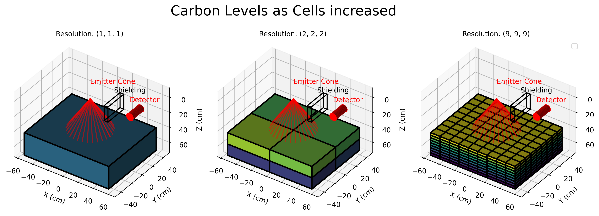
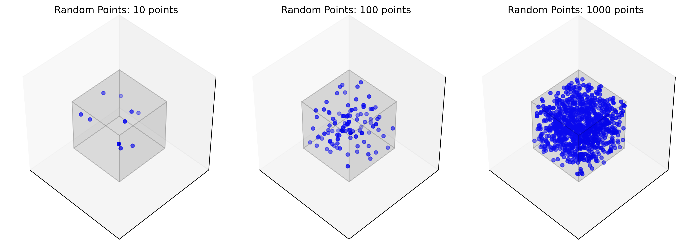
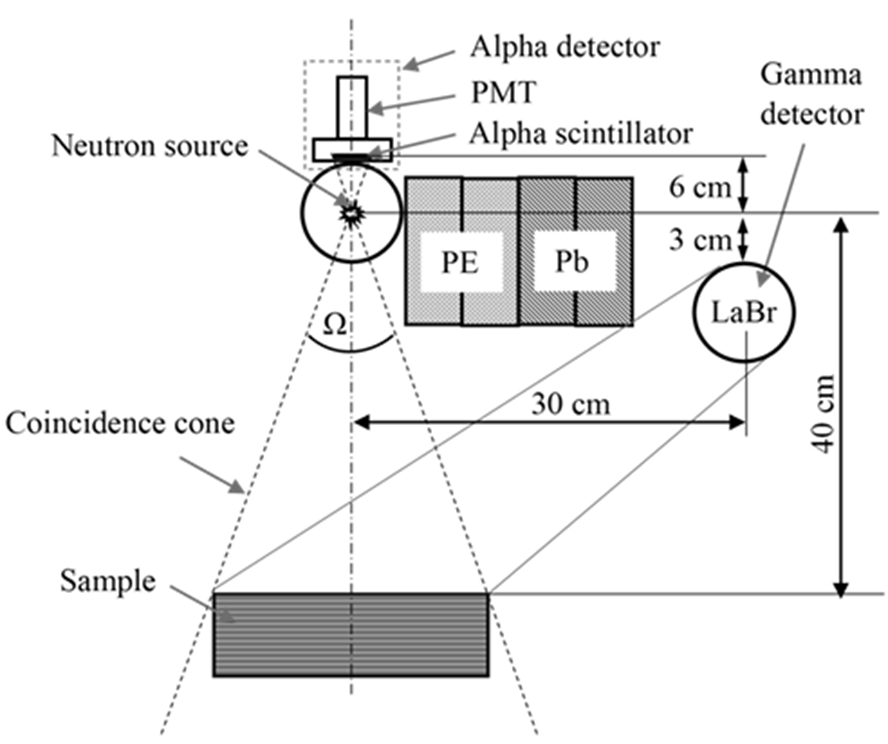

# Outline

## Mesh Cells to Augment in Situ Spectroscopy

Presenter: Jose Andres Cortes
Advisors: Andrej Korzeniowski, Allen Torbert, Galina Yakubova and Aleksandr Kavetskiy
Groups: UTA Mathematics, USDA Agriculture Research Service
Date: July 8, 2025

*Good Morning, My name is Jose Andres Cortes. I'm a second year grad student in mathematics from the University of Texas at Arlington. I am also an intern for the US Department of Agriculture. My advisors are doctors Andrej Korzeniowski, Allen Torbert, Galina Yakubova and Aleksandr Kavetskiy.*

## Background

- Collaborating with USDA Agriculture Research Service
- Developing an in situ spectroscopy device for soil analysis

*For the last two years my advisor and I have collaborated with the USDA Agriculture Research Service, assisting them in the development of an in situ spectroscopy device.*

## Core Harvesting

- Traditional method: “Core Harvesting”
- Large soil cores extracted and analyzed in lab
- Time-consuming, labor-intensive

*Currently the method of measuring carbon in a field is "Core Harvesting". Core harvesting is where large tubes called "cores" are dug into the soil and taken to a lab for analysis.*

## In Situ Spectroscopy Device

- Fast, nondestructive, cost-effective alternative
- “Mobile Inelastic Neutron Scattering System”
- Uses gamma ray spectroscopy to measure soil composition directly

*In situ spectroscopy is a fast, nondestructive, and cheap alternative to core harvesting. Called the "Mobile Inelastic Neutron Scattering System". This device uses gamma ray spectroscopy in order to measure soil composition directly on the soil.*

## Simulation is done in MCNP

- My role: Mathematical support and simulation
- Analyze and generate spectroscopy results
Simulations performed in MCNP6.2
- Presenting challenges addressed with MCNP

*As an intern I have ben tasked with mathematical support of the project. This includes analysis of the the spectroscopy results and also the generation of spectroscopy results in simulation.Simulation is done in MCNP6.2 and today i will be presenting some challenges that I answered with the software.*

## Soil is a Nonhomogenous Material

- MCNP cells assume homogeneous material
Real soil: heterogeneous at many scales
- Carbon often decreases exponentially with depth

*In MCNP, cells are used to define geometry and material properties.But it assumes that a cells material is homogeneous within the cell.In reality, soil is heterogeneous, with varying properties at different scales. This can be true over whole fields, but even within the range of detection, carbon content can be varied. Particularly in depth, where most of the carbon that is deposited can be modeled as exponentially decreasing.*

## Functionally Defined Soil

- Soil characteristics can be described as functions of 3D space
- Needed a way to translate this into MCNP input

*Mathematically we can describe the soil characteristics with a function dependent on 3 dimensional space. I needed a method to translate this description into MCNP.*

## Mesh Cells

- Divide soil into a mesh of smaller cells
Approximate functional characteristics in discrete space
- Higher mesh resolution = more accurate representation

*Instead of modeling the soil as a single cell, we can cut it into a mesh of smaller cells, from here we can approximate functional characteristics into discrete space. We start with a function describing relevant soil characteristics that are varied spatially. We then describe the geometry of the sample. The geometry is cut into sections of an arbitrary resolution. The higher the resolution, the more accurate the results would be to the functional description.*

## Defining cell characteristics

- Use Monte Carlo sampling to average properties in each mesh cell
- Assign average values to each cell
Results in a more detailed, accurate soil mode

*in each section, we use monte carlo to randomly and uniformly pick many points inside the volume to find the average characteristic. The average characteristics are then set as the defenition of the section. Mesh cells create a more detailed representation of the soil sample. This allows for more accurate modeling of the interaction between the radiation and the soil, leading to better predictions of spectral readings.*

## effects on detection

- Start with a homogeneous cell, then subdivide
- As mesh resolution increases, carbon density approaches true function
- Spectral readings become more accurate
- Readings are sensitive to local variations

*Here, we begin with a homogeneous cell, which is then cut into a mesh of smaller cells. As we increase he resolution of the method, the discrete characterisic of carbon density approahes the functional. We can see the effects on spectral readings. This imples that the readings are heavily dependent on proximity.*

## Soil is a Semi-Infinite Sample

- Investigate detection range of the device
- Lab: detector covers entire sample
- Field: soil is semi-infinite, detection range is finite

*One of the focuses of my work has been on the range of the machine. In lab spectroscopy, the detector can be situated such that the entire sample is within range. On the field, soil is semi-infinite but the probing done by the detection system is still finite.*

## Cell Mesh vs FMESH

- MCNP FMESH: tally results in mesh bins (for imaging, range studies)
- Cell meshes: can also tally per cell
- Both methods help analyze detection range

*So how can you measure range in MCNP? The FMESH feature allows you to tally based on a predefined mesh that cuts a cell into sections, becoming bins in a tally. This feature is meant for imaging on the detector side, and can also be used to investigate the range from the neutron source into the sample. Similarly, cell meshes can have tallies applied to them, accomplishing the same thing as FMESH.*

## Independent Cell Functionality

- Treat mesh cells as independent
- CU card: bins tally by cell of interaction
- Allows investigation of where detections originate

*The added functionality on top of this is the treatment of the cell mesh as independent cells. The CU card bins a tally based on the cell where the interacting particle was generated. By setting the parameters of the CU card to the cells in the mesh, we can investigate where the detectors are detecting.*

## Cell clouds

*We can order the cells by their detection ratios, and get a better grasp of where the top 90, 95 and 99% of unimpeded signal is originating.*

## Range measurement

- Example: measure energy deposition in detector, binned by mesh cell
- Weighted sum of tallies per bin

Figure: Comparison of homogeneous vs. meshed cell with same measured carbon content

*In this example I measure the heating deposition into the detector, binned by mesh cells. I take the weighted sum of tallies per bin. Relatively, i use these values to describe the proportional effect on the detector result. Lets compare the spectral readings and range of a homogeneous cell with a cell mesh with the same amount of measured carbon.*

## Usage Example

- When machine design changes, simulate new detection results
- Range can be re-evaluated
- Example: pointing emitter under detector changes detection range

*Moving forward, when the architecture of the machine is changed and the detection results are simulated, range can also be determined. In this example, as we point the emmiter under the detector, we see the effects on the range.*

## Code

*Examples and a tool for cell and tally generation can be found on my github*

## Acknoledgements

*Thanks to my advisors for guiding me through this process. Thank you to UTA and USDA-ARS for funding my research*

## References

[^1] - Yakubova et al. - 2014 - Field Testing a Mobile Inelastic Neutron Scattering System to Measure Soil Carbon.

