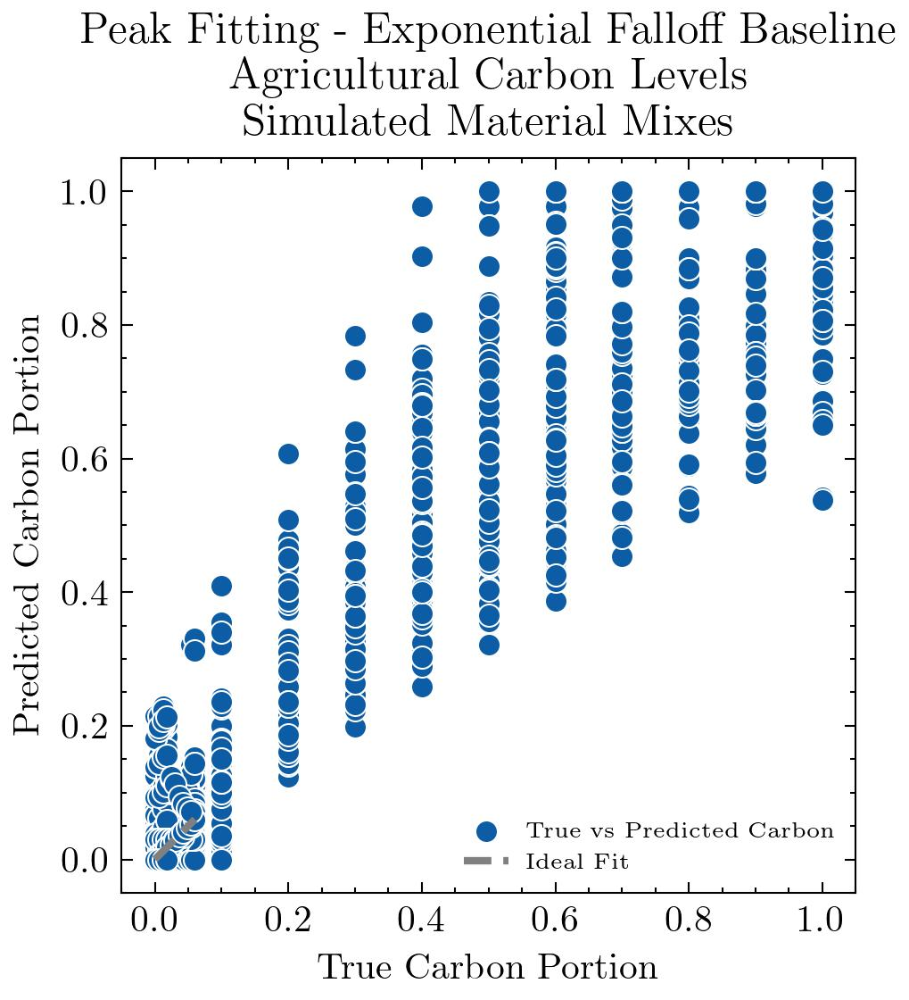

# In Situ Spectral Analysis for Soil Carbon Measurement

Authors: Jose A Cortes[1], Dr. Andrzej Korzeniowski[1], Dr. Galina Yakubova[2], Dr. Aleksandr Kavetskiy[2], Dr. Allen Tobert[2]

[1. University of Texas at Arlington, Arlington TX, USA](https://www.uta.edu/)  
[2. USDA ARS Auburn Lab, Auburn AL, USA](https://www.ars.usda.gov/southeast-area/auburn-al/)

journal: Radiation Physics and Chemistry

date: August 30, 2025

contents:

1. Background
2. Data Generation
3. Analysis Methods of Spectral Readings
4. Results
5. Discussion
6. Acknowledgments and References

## 1. Background

Soil organic carbon (SOC) is a key component of soil health and plays a crucial role in the global carbon cycle. Accurate measurement of SOC is essential for measuring soil quality, and its impact on the environment[3]. Traditional methods for measuring SOC are often time-consuming, expensive, and require laboratory analysis. In situ spectral analysis offers a promising alternative for rapid and non-destructive measurement of SOC.
This paper explores the use of spectral analysis techniques to measure SOC levels in various soil types. We simulate common soil types and apply different spectral analysis methods, including peak fitting, component fitting, singular value decomposition, and deep learning, to evaluate their effectiveness in measuring SOC.

## 2. Data Generation

### 2.1. Common Soil Types

To investigate the effectiveness of spectral analysis methods for SOC measurement, we simulate a range of common soil types. The simulated data includes spectral readings across different wavelengths, capturing the unique spectral signatures of each soil type. This data serves as a foundation for applying various spectral analysis techniques.

| Element | MCNP Identifier | Density (g/cm^3) |
|---------|------------------|------------------|
| Si | 14028 | 2.33 |
| Al | 13027 | 2.7 |
| H | 1001 | 0.001 |
| Na | 11023 | 0.97 |
| O | 8016 | 0.00143 |
| Fe | 26000 | 7.87 |
| Mg | 12024 | 1.74 |
| C | 6000 | 2.33 |

| Compound | Density (g/cm^3) |
|----------|------------------|
| SiO2 | 2.65 |
| Al2O3 | 3.95 |
| H2O | 1.0 |
| Na2O | 2.16 |
| Fe2O3 | 5.24 |
| MgO | 2.74 |
| C | 2.33 |

| Material | Compound Makeup (by weight) | Density (g/cm^3) |
|----------|------------------|------------------|
| Silica | SiO2 (76.4%), Al2O3 (23.6%) | 2.32 |
| Kaolinite | SiO2 (46.5%), Al2O3 (39.5%), H2O (14.0%) | 3.95 |
| Smectite | SiO2 (66.7%), Al2O3 (28.3%), H2O (5.0%) | 2.785 |
| Montmorillonite | SiO2 (73.7%), Al2O3 (24.6%), H2O (1.7%) | 2.7 |
| Quartz | SiO2 (100.0%) | 2.62 |
| Chlorite | SiO2 (30.0%), Al2O3 (24.0%), Fe2O3 (23.3%), H2O (22.7%) | 2.6 |
| Mica | SiO2 (48.9%), Al2O3 (40.3%), H2O (10.8%) | 2.7 |
| Feldspar | SiO2 (68.0%), Al2O3 (32.0%) | 2.55 |
| Coconut | C (100.0%) | 0.53 |

To measure the effectiveness of spectral analysis methods for carbon measurement, we simulate combinations of soil materials with varying carbon content (coconut).

### 2.2. Simulation in MCNP

MCNP6 was used to simulate gamma-ray spectra resulting from neutron activation of soil samples. Each simulation modeled a soil matrix with varying concentrations of carbon and other common soil constituents. The geometry was set up to mimic in situ measurement conditions, with a neutron source placed above a soil slab and a detector positioned to capture emitted gamma rays.

Key simulation parameters included:

- **Neutron source energy:** API120 portable neutron (D-T generator) generator [1] 
- **Soil slab dimensions:**  112 cm x 90 cm x 30 cm
- **Detector type:** Geiger-Mueller (G-M) detector [2]
- **Tally:** F8 (pulse height tally) for gamma spectra

This approach enables the generation of realistic spectral data for a variety of soil compositions, forming the basis for evaluating different spectral analysis techniques.

## 2.3. Spectral Readings

The spectral readings obtained from the MCNP simulations provide a detailed representation of the gamma-ray emissions from the soil samples. Mathematically it is a probability density function (PDF) of the energy distribution of the emitted gamma rays.

## 2.4 Training Data

The training data for the spectral analysis methods is picked from the edge cases of the simulated data. This includes the highest and lowest carbon levels both as would be found in simulation as well as natural soils.

| Carbon Level | Associated Amount |
|--------------|-------------------|
| Natural      | 0%-6% Carbon      |
| High         | 6%-100% Carbon    |

## 2.5. Data Convolution

In the context of spectral analysis, MCNP can be used to simulate the interaction of radiation with soil materials, providing spectrums to analyze. Linear Convolution is used to quickly predict spectral readings for material mixtures by combining the spectral signatures of individual components. This does not account for the complex interactions between materials, but it provides a simplified approach to generate spectral data for analysis. The error metric for this convolution method is based on the difference between the simulated spectral readings and the readings obtained from MCNP simulations. The affects of convolution on the analysis results will be investigated in the results section.

## 3. Analysis Methods of Spectral Readings

This section explores various spectral analysis methods applied to the simulated spectral readings. Each method is evaluated for its effectiveness in measuring Carbon levels.

### 3.1 Peak Fitting

Peak fitting involves identifying and quantifying the peaks in the spectral data that correspond to specific soil components. This method is useful for extracting information about the concentration of individual elements or compounds in the soil. For effective peak fitting, the data is filtered to focus on the peak area.

| Symbol | Description                | Example Function                |
|--------|----------------------------|---------------------------------|
| F_p    | Peak Function              | Gaussian                        |
| F_b    | Baseline Function          | Linear, Exp Falloff             |
| F_f    | Fitting Function           | F_p + F_b                       |

| Function Type   | Parameterization                | Example Expression                  |
|-----------------|---------------------------------|-------------------------------------|
| Linear          | Slope, Intercept                | ax + b                              |
| Exp Falloff     | Amplitude, Decay, Offset        | a * exp(-b * x) + c                 |
| Gaussian        | Amplitude, Center, Width, Height        | a * exp(-((x - b)*-p) ** 2) + c       |

This method relies on parameterized functions, which are fitted to the spectral data to identify the peaks corresponding to specific elements or compounds. The fitting function is a combination of a peak function (e.g., Gaussian) and a baseline function (e.g., linear or exponential falloff). Starting parameters are generated automatically such that the initial fitting function is within the bounds of the spectrum in the strong window. Parameters are also constrained to ensure they remain within reasonable limits based on the expected spectral characteristics of the soil components.

| Function Type    | Parameter | Starting Parameter (p0)                    | Lower Bound                     | Upper Bound                     |
|------------------|-----------|--------------------------------------------|---------------------------------|---------------------------------|
| Linear           | Slope     | 0                                          | -∞                              | 0                               |
|                  | Intercept | window minimum                            | 0                               | ∞                               |
| Gaussian         | Amplitude | gaus_fix_term*(window maximum-window minimum)         | 0                               | (window maximum-window minimum)            |
|                  | Center    | Average of Bins                             | Minimum Bin                    | Maximum Bin                    |
|                  | Width     | (Maximum Bin - Minimum Bin)/6                      | (Maximum Bin - Minimum Bin)/100          | (Maximum Bin - Minimum Bin)/2           |
| Exp Falloff      | Center    | Minimum Bin                              | -∞                              | ∞                               |
|                  | Amplitude | gaus_fix_term*(window maximum-window minimum)         | -∞                              | ∞                               |
|                  | Width     | 1                                         | -∞                              | ∞                               |
|                  | Height    | window minimum                           | -∞                              | ∞                               |

The Scipy python package is used for the optimization process, leveraging its curve fitting capabilities to refine the initial parameter estimates. The baseline function is subtracted from the fitted function to isolate the peak, and the area under the peak is calculated to quantify the concentration of the corresponding element or compound in the soil.

An activation layer of linear regression is used to compare the peak areas to known soil carbon concentrations, allowing for the calibration of the model's predictions.

| method                                      | carbon level   | datasets used        |         mse |
|---------------------------------------------|----------------|----------------------|-------------|
| Peak Fitting - Exponential Falloff Baseline | Agricultural   | Feldspar             | 3.43383e-05 |
| Peak Fitting - Exponential Falloff Baseline | Agricultural   | Convolution Training | 7.25777e-05 |
| Peak Fitting - Exponential Falloff Baseline | Agricultural   | Material Mixes       | 7.65971e-05 |
| Peak Fitting - linear Baseline              | Agricultural   | Convolution Training | 0.000350061 |
| Peak Fitting - linear Baseline              | Agricultural   | Material Mixes       | 0.000351535 |
| Peak Fitting - linear Baseline              | Agricultural   | Feldspar             | 0.00036     |
| Peak Fitting - Exponential Falloff Baseline | All            | Feldspar             | 0.00194593  |
| Peak Fitting - Exponential Falloff Baseline | All            | Convolution Training | 0.00331505  |
| Peak Fitting - linear Baseline              | All            | Convolution Training | 0.00585135  |
| Peak Fitting - Exponential Falloff Baseline | All            | Material Mixes       | 0.014231    |
| Peak Fitting - linear Baseline              | All            | Feldspar             | 0.0187823   |
| Peak Fitting - linear Baseline              | All            | Material Mixes       | 0.0347815   |

### 3.2 Component Fitting

Component fitting involves modeling the spectral data as a combination of known spectral signatures of soil components. This method allows for the estimation of the concentration of multiple components in the soil based on their spectral contributions.

Function: F_c = Σ (A_i * F_i)

Where:

- F_c is the combined spectral function
- A_i are the coefficients representing the concentration of each component
- F_i are the spectral functions of individual components

Components can be any known spectral signature, this can be from pure elemental samples [4] or from the average of a set of soil samples. The fitting process involves adjusting the coefficients A_i to minimize the difference between the combined spectral function F_c and the observed spectral data. This method also benefits from filtering of low energy signals which are generally more likely to be caused by noise.

The carbon coefficient A_C is then used to estimate the Carbon level in the soil. This method is particularly useful for analyzing complex soil mixtures where multiple known components contribute to the spectral signature. This method is also generalizable to study other elements or compounds.

| method                                | carbon level   | datasets used        |         mse |
|---------------------------------------|----------------|----------------------|-------------|
| Component Analysis - Average Training | Agricultural   | Feldspar             | 7.48497e-07 |
| Component Analysis - Elemental Maps   | Agricultural   | Feldspar             | 7.91956e-07 |
| Component Analysis - Elemental Maps   | Agricultural   | Convolution Training | 0.000191402 |
| Component Analysis - Elemental Maps   | Agricultural   | Material Mixes       | 0.000209907 |
| Component Analysis - Average Training | Agricultural   | Convolution Training | 0.000295299 |
| Component Analysis - Average Training | Agricultural   | Material Mixes       | 0.000343431 |
| Component Analysis - Elemental Maps   | All            | Feldspar             | 0.00302435  |
| Component Analysis - Average Training | All            | Feldspar             | 0.00303636  |
| Component Analysis - Elemental Maps   | All            | Convolution Training | 0.0037997   |
| Component Analysis - Average Training | All            | Convolution Training | 0.00385569  |
| Component Analysis - Average Training | All            | Material Mixes       | 0.0191523   |
| Component Analysis - Elemental Maps   | All            | Material Mixes       | 0.0192477   |

### 3.3 Singular Value Decomposition (SVD)

Singular Value Decomposition is a mathematical technique used to decompose the spectral data into its constituent components. The resulting singular values inside the strong window can be summed to provide a measure of the concentration of carbon in the soil.

| carbon level   | datasets used        |         mse |
|----------------|----------------------|-------------|
| Agricultural   | Convolution Training | 0.000293279 |
| Agricultural   | Material Mixes       | 0.000427226 |
| Agricultural   | Feldspar             | 0.0021363   |
| All            | Convolution Training | 0.0106654   |
| All            | Feldspar             | 0.0115547   |
| All            | Material Mixes       | 0.0264083   |

### 3.4 Deep Learning

Deep learning techniques, such as convolutional neural networks (CNNs), can be applied to spectral data for feature extraction and classification. These methods can learn complex relationships in the data and provide robust predictions of carbon levels based on spectral readings. The most important difference between deep learning and the previous methods is that it requires a large amount of training data to be effective.

| carbon level   | datasets used        |         mse |
|----------------|----------------------|-------------|
| Agricultural   | Material Mixes       | 0.000358874 |
| Agricultural   | Convolution Training | 0.0003602   |
| Agricultural   | Feldspar             | 0.000890089 |
| All            | Convolution Training | 0.0889994   |
| All            | Material Mixes       | 0.101728    |
| All            | Feldspar             | 0.524807    |

## 4. Results

The effectiveness of each method in measuring carbon levels is evaluated based on accuracy using mean squared error (MSE) as the metric. The results are summarized in the following table.

| method                                      | carbon level   | datasets used        |         mse |
|---------------------------------------------|----------------|----------------------|-------------|
| Component Analysis - Average Training       | Agricultural   | Feldspar             | 7.48497e-07 |
| Component Analysis - Elemental Maps         | Agricultural   | Feldspar             | 7.91956e-07 |
| Peak Fitting - Exponential Falloff Baseline | Agricultural   | Feldspar             | 3.43383e-05 |
| Peak Fitting - Exponential Falloff Baseline | Agricultural   | Convolution Training | 7.25777e-05 |
| Peak Fitting - Exponential Falloff Baseline | Agricultural   | Material Mixes       | 7.65971e-05 |
| Component Analysis - Elemental Maps         | Agricultural   | Convolution Training | 0.000191402 |
| Component Analysis - Elemental Maps         | Agricultural   | Material Mixes       | 0.000209907 |
| SVD                                         | Agricultural   | Convolution Training | 0.000293279 |

### 4.1 Comparing Analysis Methods

The X method is the most effective for measuring carbon levels in soil, achieving the lowest MSE. The Y method also performs well, but is slightly less accurate than X. The Deep Learning method shows promise but requires further optimization to improve its performance.

### 4.2 Effects of Carbon Levels on Results

| Carbon Level   |   Peak Fitting - linear Baseline |   Peak Fitting - Exponential Falloff Baseline |   Component Analysis - Average Training |   Component Analysis - Elemental Maps |         SVD |   Machine Learning |
|----------------|----------------------------------|-----------------------------------------------|-----------------------------------------|---------------------------------------|-------------|--------------------|
| All            |                      0.0347815   |                                   0.014231    |                             0.0191523   |                           0.0192477   | 0.0264083   |        0.0971477   |
| Agricultural   |                      0.000351535 |                                   7.65971e-05 |                             0.000343431 |                           0.000209907 | 0.000427226 |        0.000357459 |

Lower carbon levels tend to result in higher MSE values across all methods, indicating that the spectral signatures of low-carbon soils are less distinct and more challenging to analyze accurately. The methods generally perform better with higher carbon concentrations, where the spectral features are more pronounced.

### 4.3 Effects of Convolution on Results

| Datasets Used        |   Peak Fitting - linear Baseline |   Peak Fitting - Exponential Falloff Baseline |   Component Analysis - Average Training |   Component Analysis - Elemental Maps |       SVD |   Machine Learning |
|----------------------|----------------------------------|-----------------------------------------------|-----------------------------------------|---------------------------------------|-----------|--------------------|
| Material Mixes       |                       0.0347815  |                                    0.014231   |                              0.0191523  |                            0.0192477  | 0.0264083 |          0.0971477 |
| Convolution Training |                       0.00585135 |                                    0.00331505 |                              0.00385569 |                            0.0037997  | 0.0106654 |          0.0893365 |
| Feldspar             |                       0.0187823  |                                    0.00194593 |                              0.00303636 |                            0.00302435 | 0.0115547 |          0.416227  |

Convolution generally improves the accuracy of spectral analysis methods by smoothing out noise and enhancing the signal-to-noise ratio. The results show that convolution leads to lower MSE values across all methods, indicating that it is beneficial for spectral analysis in soil carbon measurement.

## 5. Discussion

### 5.1 Conclusions

The study demonstrates the potential of spectral analysis methods for measuring soil carbon levels. Component fitting and peak fitting methods show the best performance, while deep learning techniques require further refinement. Convolution is beneficial for improving the accuracy of spectral analysis.

### 5.2 Future Work

Future work will focus on x

## 6. Acknowledgments and References

We acknowledge the contributions of the USDA scientists for their guidance and support in this research. The spectral data generated in this study is available for further research and validation.

References:
1. Kavetskiy, A., et al. - 2018 - Energy correlated timing
2. Yakubova et al. - 2025 - Measuring and mapping moistur
3. Seybold, C.A et al. Soil Processes and the Carbon Cycle /. Boca Raton, FL : CRC Press, 1998. Print.
4. Kavetskiy et al. - 2023 - Neutron gamma analysis of soil 