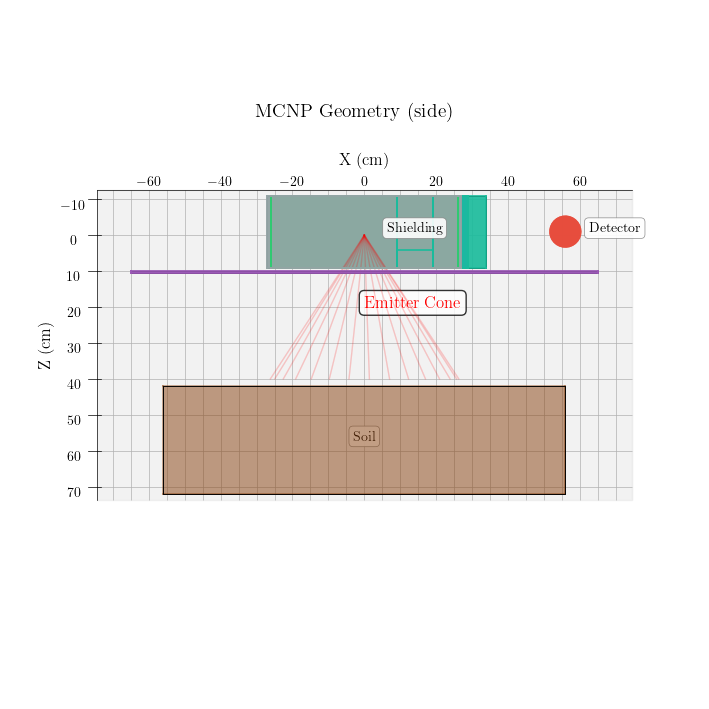
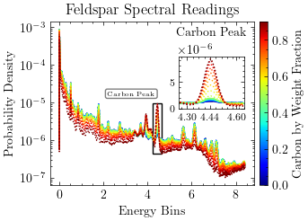
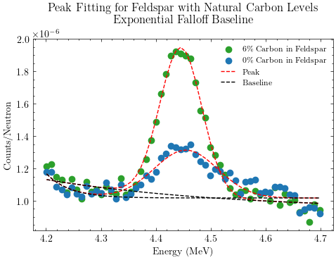
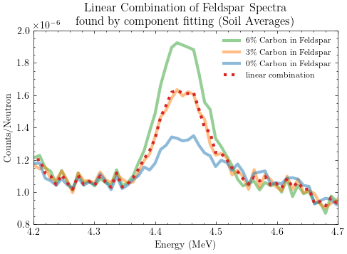
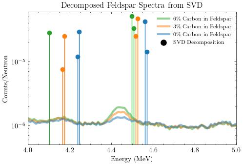
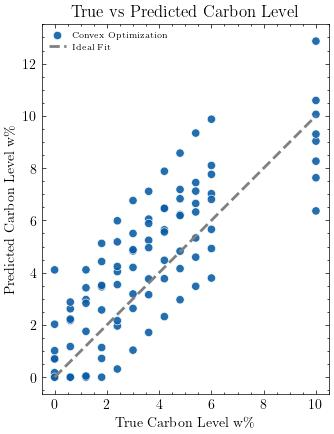

# In Situ Spectral Analysis for Soil Carbon Measurement

Authors: Jose A Cortes[1], Dr. Andrzej Korzeniowski[1], Dr. Galina Yakubova[2], Dr. Aleksandr Kavetskiy[2], Dr. Allen Tobert[2]

[1. University of Texas at Arlington, Arlington TX, USA](https://www.uta.edu/)  
[2. USDA ARS Auburn Lab, Auburn AL, USA](https://www.ars.usda.gov/southeast-area/auburn-al/)

journal: Radiation Physics and Chemistry

date: August 30, 2025

## Abstract

Abstract

Soil carbon is a key component of soil health and plays a crucial role in the global carbon cycle. Accurate measurement of carbon is essential for measuring soil quality and its impact on the environment. Traditional methods for measuring carbon are often time-consuming, expensive, and require laboratory analysis. In situ Neutron-Gamma spectral analysis (NGSA) offers an alternative for rapid and non-destructive measurement of soil carbon. This paper explores the use of NGSA techniques to measure carbon levels in various soil types. We simulate in MCNP6.2 common soil types and apply different NGSA methods, including peak fitting, component fitting, singular value decomposition, and deep learning, to evaluate their effectiveness in measuring of soil carbon. The results demonstrate that peak fitting with exponential falloff baseline achieves the lowest mean squared error (7.66 × 10−5), followed by component analysis methods. The study shows that NGSA methods can provide accurate soil carbon measurements, with convolution techniques improving overall accuracy across all methods.

Keywords: soil carbon, spectral analysis, gamma-ray spectroscopy, MCNP simulation, peak fitting, component analysis, deep learning

contents:

1. Background
2. Data Generation
3. Analysis Methods of Spectral Readings
4. Results
5. Discussion
6. Acknowledgments and References

## 1. Background

Soil carbon is a key component of soil health and plays a crucial role in the global carbon cycle. Accurate measurement of carbon is essential for measuring soil quality, and its impact on the environment [Lal et al., 2018]. Traditional methods for measuring carbon are often time-consuming, expensive, and require laboratory analysis [Smith et al., 2020]. In situ Neutron Gamma Spectral Analysis, NGSA offers an alternative for rapid and non-destructive measurement of soil carbon [Yakubova et al., 2019]. This paper explores the use of NGSA techniques to measure carbon levels in various soil types. We simulate in MCNP6.2 common soil types and apply different NGSA methods, including peak fitting, component fitting, singular value decomposition, and deep learning, to evaluate their effectiveness in measuring soil carbon.

## 2. Data Generation

### 2.1. Common Soil Types

To investigate the effectiveness of NGSA methods for soil carbon measurement, we simulate a range of common soil types. The simulated data includes spectral readings across different wavelengths, capturing the unique spectral signatures of each soil type. This data serves as a foundation for applying various NGSA techniques.

| Material   |   C % |   H % |   O % |   Si % |   Na % |   Al % |   K % |
|:-----------|------:|------:|------:|-------:|-------:|-------:|------:|
| Carbon     | 100.0 |   0.0 |   0.0 |    0.0 |    0.0 |    0.0 |   0.0 |
| Water      |   0.0 |  11.2 |  88.8 |    0.0 |    0.0 |    0.0 |   0.0 |
| Quartz     |   0.0 |   0.0 |  53.3 |   46.7 |    0.0 |    0.0 |   0.0 |
| Feldspar   |   0.0 |   0.0 |  48.8 |   32.1 |    8.8 |   10.3 |   0.0 |
| Mica       |   0.0 |   0.5 |  48.2 |   21.2 |    0.0 |   20.3 |   9.8 |

Table x presents the elemental composition of common soil materials used in the simulations. Mechanical mixing is used to combine materials based on their weight proportions, such that a 50% carbon and 50% water mix would have a composition of 50% carbon, 5.6% hydrogen, and 44.4% oxygen. To measure the effectiveness of NGSA methods for carbon measurement, we simulate combinations of soil materials with varying carbon (C) and moisture (Water) content.

### 2.2. Simulation in MCNP6.2

MCNP6.2 [Werner et al., 2017] was used to simulate gamma-ray spectra resulting from neutron activation of soil samples. Each simulation modeled a soil sample undergoing neutron activation with varying concentrations of carbon and other common soil constituents. The geometry was set up to mimic in situ measurement conditions, with a neutron source placed above a soil slab and a detector positioned to capture emitted gamma rays [Kavetskiy et al., 2017].

Key simulation parameters included:

- **Neutron source energy:** API120 portable neutron (D-T generator) generator [Kavetskiy et al., 2018] 
- **Soil slab dimensions:**  112 cm x 90 cm x 30 cm
- **Detector type:** Geiger-Mueller (G-M) detector [Yakubova et al., 2025]
- **Tally:** F8 (pulse height tally) for gamma spectra

| Element         |    C |    H |    O |    Si |    Na |    Al |     K |
|:----------------|-----:|-----:|-----:|------:|------:|------:|------:|
| MCNP Identifier | 6000 | 1001 | 8016 | 14028 | 11021 | 13027 | 19000 |

This approach enables the generation of realistic spectral data for a variety of soil compositions, forming the basis for evaluating different NGSA techniques.

### 2.3. Spectral Readings

The spectral readings obtained from the MCNP simulations provide a detailed distribution of the gamma-ray emissions from the soil samples per neutron, similar to what would be measured in a real-world scenario.

### 2.4 Training and Testing Data

The training data for the NGSA methods is picked from the edge cases of the simulated data. This includes the highest and lowest carbon levels both as would be found in simulation as well as natural soils. The testing data is all cases of the simulated data, excluding the training data.

| Carbon Level | Associated Amount |
|--------------|-------------------|
| Natural      | 0%-6% Carbon      |
| High         | 6%-100% Carbon    |

### 2.5. Data Convolution

In the context of NGSA, MCNP can be used to simulate the interaction of radiation with soil materials, providing spectrums to analyze. Linear Convolution is used to quickly predict spectral readings for material mixtures by combining the spectral signatures of individual components. This does not account for the complex interactions between materials, but it provides a simplified approach to generate spectral data for analysis. The error metric for this convolution method is based on the difference between the simulated spectral readings and the readings obtained from MCNP simulations. The effects of convolution as training data on the analysis results will be investigated in the results section.

## 3. Analysis Methods of Spectral Readings

This section explores various NGSA methods applied to the simulated spectral readings. Each method is evaluated for its effectiveness in measuring Carbon levels.
Error is calculated using mean squared error (MSE) between the predicted and actual carbon levels in the test data.

### 3.0 Calibration Layer

All models undergo a calibration process to align their predictions with the carbon measurements. This involves a regression model between a key characteristic and the predicted values. A linear regression model is used for this purpose.

The Scipy python package is used for the fitting process [Virtanen et al., 1977], leveraging its curve fitting capabilities to refine the initial parameter estimates. All fitting problems are taken as fitting a curve f(x, p0) where p0 are the initial parameters. The fitting process iteratively adjusts these parameters to minimize the difference between the predicted and actual values, using a least-squares approach. The Levenberg-Marquardt algorithm is employed to optimize the fitting process [Moré 1978]. When the fitting is bounded, Trust Region Reflective optimization [Branch et al., 1999] is used.

### 3.1 Peak Fitting

Baseline - Peak fitting involves using the least-squares method in identifying and quantifying the baseline and peaks in the spectral data that correspond to specific soil components [Gardner et al., 2011]. This method is useful for extracting information about the concentration of individual elements or compounds in the soil. For effective peak fitting, the data is filtered to focus on the peak area.

| Symbol | Description                | Example Function                |
|--------|----------------------------|---------------------------------|
| F_p    | Peak Function              | Gaussian                        |
| F_b    | Baseline Function          | Linear, Exp Falloff             |
| F_f    | Fitting Function           | F_p + F_b                       |

| Function Type   | Parameterization                | Example Expression                  |
|-----------------|---------------------------------|-------------------------------------|
| Linear          | Slope, Intercept                | ax + b                              |
| Exp Falloff     | Amplitude, Decay, Offset        | a * exp(-b * x) + c                 |
| Gaussian        | Amplitude, Center, Width, Height        | a * exp(-((x - b)*-p) ** 2) + c       |

This method relies on parameterized functions, which are fitted to the spectral data to identify the peaks corresponding to specific elements or compounds. The fitting function is a combination of a peak function (e.g., Gaussian) and a baseline function (e.g., linear or exponential falloff). Starting parameters are generated automatically such that the initial fitting function is within the bounds of the spectrum in the strong window. Parameters are also constrained to ensure they remain within reasonable limits based on the expected spectral characteristics of the soil components.

| Function Type    | Parameter | Starting Parameter (p0)                    | Lower Bound                     | Upper Bound                     |
|------------------|-----------|--------------------------------------------|---------------------------------|---------------------------------|
| Linear           | Slope     | 0                                          | -∞                              | 0                               |
|                  | Intercept | window minimum                            | 0                               | ∞                               |
| Gaussian         | Amplitude | gaus_fix_term*(window maximum-window minimum)         | 0                               | (window maximum-window minimum)            |
|                  | Center    | Average of Bins                             | Minimum Bin                    | Maximum Bin                    |
|                  | Width     | (Maximum Bin - Minimum Bin)/6                      | (Maximum Bin - Minimum Bin)/100          | (Maximum Bin - Minimum Bin)/2           |
| Exp Falloff      | Center    | Minimum Bin                              | -∞                              | ∞                               |
|                  | Amplitude | gaus_fix_term*(window maximum-window minimum)         | -∞                              | ∞                               |
|                  | Width     | 1                                         | -∞                              | ∞                               |
|                  | Height    | window minimum                           | -∞                              | ∞                               |

The baseline function is subtracted from the fitted function to isolate the peak, and the area under the peak is calculated to quantify the concentration of the corresponding element or compound in the soil.

An activation layer of linear regression is used to compare the peak areas to known soil carbon concentrations, allowing for the calibration of the model's predictions.

| method                                                   |         mse |
|----------------------------------------------------------|-------------|
| Baseline and Peak Fitting - Exponential Falloff Baseline | 7.65971e-05 |
| Baseline and Peak Fitting - linear Baseline              | 0.000351535 |

### 3.2 Component Fitting

Component fitting involves modeling the spectral data as a combination of known spectral signatures of soil components. This method allows for the estimation of the concentration of multiple components in the soil based on their spectral contributions.

Function: F_c = Σ (A_i * F_i)

Where:

- F_c is the combined spectral function
- A_i are the coefficients representing the concentration of each component
- F_i are the spectral functions of individual components

Components can be any known spectral signature, this can be from pure elemental samples [Kavetskiy et al., 2023] or from the average of a set of soil samples. The fitting process involves adjusting the coefficients A_i to minimize the difference between the combined spectral function F_c and the observed spectral data. This method also benefits from filtering of low energy signals which are generally more likely to be caused by noise.

The carbon coefficient A_C is then used to estimate the Carbon level in the soil. This method is particularly useful for analyzing complex soil mixtures where multiple known components contribute to the spectral signature. This method is also generalizable to study other elements or compounds.

| method                                |         mse |
|---------------------------------------|-------------|
| Component Analysis - Elemental Maps   | 0.000209907 |
| Component Analysis - Average Training | 0.000343431 |

### 3.3 Convex Optimization - Singular Value Decomposition (SVD)

Convex Optimization is a mathematical technique used to decompose the spectral data into convex components [Liu et al., 2020]. The resulting singular values inside the strong window can be summed to provide a measure of the concentration of carbon in the soil.

| method              |         mse |
|---------------------|-------------|
| Convex Optimization | 0.000427226 |

### 3.4 Deep Learning

Deep learning techniques, such as convolutional neural networks (CNNs), can be applied to spectral data for feature extraction and classification. These methods can learn complex relationships in the data and provide robust predictions of carbon levels based on spectral readings. The most important difference between deep learning and the previous methods is that it requires a large amount of training data to be effective. One method by Kim et al. [Kim et al., 2025] uses a deep learning model to predict existence, concentration and carbon peak areas.

| method           |         mse |
|------------------|-------------|
| Machine Learning | 0.000366705 |

## 4. Results

The effectiveness of each method in measuring carbon levels is evaluated based on accuracy using mean squared error (MSE) as the metric. The results are summarized in the following table.

| method group       | method                                                   |         mse |
|--------------------|----------------------------------------------------------|-------------|
| Peak Fitting       | Baseline and Peak Fitting - Exponential Falloff Baseline | 7.65971e-05 |
| Component Analysis | Component Analysis - Elemental Maps                      | 0.000209907 |
| Component Analysis | Component Analysis - Average Training                    | 0.000343431 |
| Peak Fitting       | Baseline and Peak Fitting - linear Baseline              | 0.000351535 |
| Machine Learning   | Machine Learning                                         | 0.000366705 |

### 4.1 Comparing Analysis Methods

The X method is the most effective for measuring carbon levels in soil, achieving the lowest MSE. The Y method also performs well, but is slightly less accurate than X. The Deep Learning method shows promise but requires further optimization to improve its performance.

### 4.2 Effects of Carbon Levels on Results

| carbon level   |   Baseline and Peak Fitting - Exponential Falloff Baseline |   Baseline and Peak Fitting - linear Baseline |   Component Analysis - Average Training |   Component Analysis - Elemental Maps |   Convex Optimization |   Filtered Machine Learning |   Machine Learning |
|:---------------|-----------------------------------------------------------:|----------------------------------------------:|----------------------------------------:|--------------------------------------:|----------------------:|----------------------------:|-------------------:|
| Agricultural   |                                                7.65971e-05 |                                   0.000351535 |                             0.000343431 |                           0.000209907 |           0.000427226 |                  0.00369571 |        0.000366705 |
| All            |                                                0.014231    |                                   0.0347815   |                             0.0191523   |                           0.0192477   |           0.0264083   |                  0.133045   |        0.101257    |

Lower carbon levels tend to result in higher MSE values across all methods, indicating that the spectral signatures of low-carbon soils are less distinct and more challenging to analyze accurately. The methods generally perform better with higher carbon concentrations, where the spectral features are more pronounced.

### 4.3 Effects of Convolution on Results

| datasets used        |   Baseline and Peak Fitting - Exponential Falloff Baseline |   Baseline and Peak Fitting - linear Baseline |   Component Analysis - Average Training |   Component Analysis - Elemental Maps |   Convex Optimization |   Filtered Machine Learning |   Machine Learning |
|:---------------------|-----------------------------------------------------------:|----------------------------------------------:|----------------------------------------:|--------------------------------------:|----------------------:|----------------------------:|-------------------:|
| Convolution Training |                                                7.25777e-05 |                                   0.000350061 |                             0.000295299 |                           0.000191402 |           0.000293279 |                 0.000365072 |        0.000360802 |
| Feldspar             |                                                3.43383e-05 |                                   0.00036     |                             7.48497e-07 |                           7.91956e-07 |           0.0021363   |                 0.011007    |        0.000930396 |
| Material Mixes       |                                                7.65971e-05 |                                   0.000351535 |                             0.000343431 |                           0.000209907 |           0.000427226 |                 0.00369571  |        0.000366705 |

Convolution generally improves the accuracy of NGSA methods by smoothing out noise and enhancing the signal-to-noise ratio. The results show that convolution leads to lower MSE values across all methods, indicating that it is beneficial for NGSA in soil carbon measurement.

## 5. Discussion

### 5.1 Conclusions

The study demonstrates the potential of NGSA methods for measuring soil carbon levels. Component fitting and peak fitting methods show the best performance, while deep learning techniques require further refinement. Convolution is beneficial for improving the accuracy of NGSA.

### 5.2 Future Work

Future work will focus on exploring advanced machine learning techniques and their integration with NGSA methods to enhance soil carbon measurement capabilities.

## 6. Acknowledgments and References

We acknowledge the contributions of the USDA scientists for their guidance and support in this research. The spectral data generated in this study is available for further research and validation.

References:

Gardner, R.P., Ai, X., Peeples, C.R., Wang, J., Lee, K., Peeples, J.L., Calderon, A., 2011. Use of an iterative convolution approach for qualitative and quantitative peak analysis in low resolution gamma-ray spectra. Nuclear Instruments and Methods in Physics Research Section A: Accelerators, Spectrometers, Detectors and Associated Equipment, Symposium on Radiation Measurements and Applications (SORMA) XII 2010 652, 544–549. https://doi.org/10.1016/j.nima.2010.12.224
Kavetskiy, A., Yakubova, G., Prior, S.A., Torbert, H.A., 2023. Neutron gamma analysis of soil carbon: Post-irradiation physicochemical effects. Environmental Technology & Innovation 31, 103219. https://doi.org/10.1016/j.eti.2023.103219
Kavetskiy, A., Yakubova, G., Prior, S.A., Torbert, H.A., 2018. Energy correlated timing spectra in target neutron techniques. Nuclear Instruments and Methods in Physics Research Section B: Beam Interactions with Materials and Atoms 433, 80–86. https://doi.org/10.1016/j.nimb.2018.07.028
Kavetskiy, A., Yakubova, G., Prior, S.A., Torbert, H.A., Kavetskiy, A., Yakubova, G., Prior, S.A., Torbert, H.A., 2017. Neutron-Stimulated Gamma Ray Analysis of Soil, in: New Insights on Gamma Rays. IntechOpen. https://doi.org/10.5772/68014
Kim, W., Ko, K., Park, J., Lee, S., Yun, H., Cho, G., 2025. Deep learning-based gamma spectroscopic analysis considering multiple variables for in situ applications. Radiation Physics and Chemistry 226, 112261. https://doi.org/10.1016/j.radphyschem.2024.112261
Lal, R., Kimble, J.M., Follett, R.F., Stewart, B.A. (Eds.), 2018. Soil Processes and the Carbon Cycle. CRC Press, Boca Raton. https://doi.org/10.1201/9780203739273
Liu, B., Yang, H., Lv, H., Jing, F., Gao, X., Yan, M., 2020. A deconvolution method for scintillator gamma-ray spectrum analysis based on convex optimization. Nuclear Instruments and Methods in Physics Research Section A: Accelerators, Spectrometers, Detectors and Associated Equipment 957, 163399. https://doi.org/10.1016/j.nima.2020.163399
Smith, P., Soussana, J.-F., Angers, D., Schipper, L., Chenu, C., Rasse, D.P., Batjes, N.H., van Egmond, F., McNeill, S., Kuhnert, M., Arias-Navarro, C., Olesen, J.E., Chirinda, N., Fornara, D., Wollenberg, E., Álvaro-Fuentes, J., Sanz-Cobena, A., Klumpp, K., 2020. How to measure, report and verify soil carbon change to realize the potential of soil carbon sequestration for atmospheric greenhouse gas removal. Global Change Biology 26, 219–241. https://doi.org/10.1111/gcb.14815
Virtanen, P., Gommers, R., Oliphant, T.E., Haberland, M., Reddy, T., Cournapeau, D., Burovski, E., Peterson, P., Weckesser, W., Bright, J., van der Walt, S.J., Brett, M., Wilson, J., Millman, K.J., Mayorov, N., Nelson, A.R.J., Jones, E., Kern, R., Larson, E., Carey, C.J., Polat, İ., Feng, Y., Moore, E.W., VanderPlas, J., Laxalde, D., Perktold, J., Cimrman, R., Henriksen, I., Quintero, E.A., Harris, C.R., Archibald, A.M., Ribeiro, A.H., Pedregosa, F., van Mulbregt, P., 2020. SciPy 1.0: fundamental algorithms for scientific computing in Python. Nat Methods 17, 261–272. https://doi.org/10.1038/s41592-019-0686-2
Werner, C.J., Armstrong, J.C., Brown, F.B., Bull, J.S., Casswell, L., Cox, L.J., Dixon, D.A., Forster, R.A., III, Goorley, J.T., Hughes, H.G., III, Favorite, J.A., Martz, R.L., Mashnik, S.G., Rising, M.E., Solomon, C.J., Jr., Sood, A., Sweezy, J.E., Zukaitis, A.J., Anderson, C.A., Elson, J.S., Durkee, J.W., Jr., Johns, R.C., McKinney, G.W., McMath, G.E., Hendricks, J.S., Pelowitz, D.B., Prael, R.E., Booth, T.E., James, M.R., Fensin, M.L., Wilcox, T.A., Kiedrowski, B.C., 2017. MCNP User’s Manual Code Version 6.2 (No. LA-UR-17-29981). Los Alamos National Laboratory, Los Alamos, NM, USA.
Wielopolski, L., Doron, O., 2012. Nuclear spectroscopy for in situ soil elemental analysis: Monte Carlo simulations. Applied Radiation and Isotopes, Proceedings of the 8th International Topical Meeting on Industrial Radiation and Radioisotope Measurement Applications (IRRMA-8) 70, 1085–1088. https://doi.org/10.1016/j.apradiso.2011.11.027
Yakubova, G., Kavetskiy, A., Prior, S.A., Torbert, H.A., 2025. Measuring and mapping moisture content in agricultural fields by neutron-gamma analysis. Soil and Tillage Research 248, 106444. https://doi.org/10.1016/j.still.2024.106444
Yakubova, G., Kavetskiy, A., Prior, S.A., Torbert, H.A., 2019. Tagged neutron method for carbon analysis of large soil samples. Applied Radiation and Isotopes 150, 127–134. https://doi.org/10.1016/j.apradiso.2019.05.028
